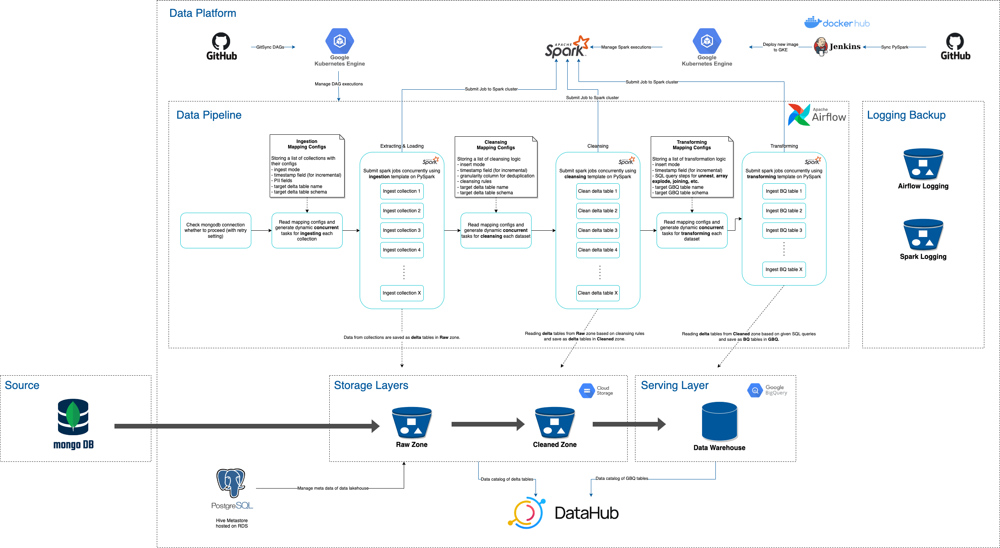

# TD test

## Question 1:



## Question 2:

The entry python application is located [./work/pyspark/src/main.py](https://github.com/ayworkable/td-test/blob/main/work/pyspark/src/main.py).

### Prepare python & dependencies (for dev)
```
rm -rf ./venv && \
  conda create --prefix ./venv python=3.8.15 --yes --channel conda-forge && \
  ./venv/bin/pip install -r requirements.txt 
```

### Start spark master and worker containers
```
docker-compose up -d
```

### Run
```
docker exec -it spark-docker-spark-1 ./bin/spark-submit \                                                                                                 
  --master spark://spark:7077 \
  ./work/pyspark/src/main.py \
  ./work/data/input/sample.txt ./work/data/output/sample-output.txt ./work/config/sanitizer_config.json
```

### Cleanup
```
docker-compose down
```

## Question 3:
```sql
with product_sales as (
  select 
  pcl.product_class_id
  , pcl.product_class_name
  , prd.product_id
  , prd.product_name
  , sum(prd.retail_price * sal.quantity) as product_sales_value
  from sales sal
  join product prd on prd.product_id = sal.product_id
  join product_class pcl on pcl.product_class_id = prd.product_class_id
  group by 
  pcl.product_class_id
  , pcl.product_class_name
  , prd.product_id
  , prd.product_name
),
class_product_sales as (
  select 
  product_class_id
  , product_class_name
  , product_id
  , product_name
  , product_sales_value
  , sum(product_sales_value) over (partition by product_class_id) as class_sales_value
  from product_sales
), class_product_sales_rank as (
  product_class_id
  , product_class_name
  , product_id
  , product_name
  , product_sales_value
  , class_sales_value
  , row_number() over (partition by product_class_id order by product_sales_value desc) as product_sales_rank
  , dense_rank() over (order by class_sales_value desc) as class_sales_rank
  from class_product_sales
)
select 
product_class_name
, product_sales_rank as rank
, product_name
, product_sales_value as sales_value
from class_product_sales_rank
where product_sales_rank <= 2
order by 
class_sales_rank
, product_sales_rank
```
